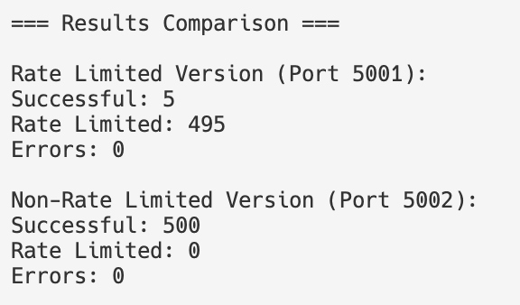

## Availability Improvements

This branch focuses on enhancing the application's **availability** by implementing and demonstrating security controls that protect against Denial-of-Service (DoS) attacks. The primary feature is the integration of **rate limiting** to ensure the platform remains accessible and resilient under high request loads.

---

### Key Activities in this Branch
- **Rate Limiting:** Integration of rate limiting middleware to defend against Denial-of-Service (DoS) attacks and ensure the application remains accessible under load.
- **Testing & Simulation:** Includes scripts (such as `attack_scripts/rate_limit_test.py`) to simulate attack scenarios and validate the effectiveness of availability controls.
- **Comparison Modes:** Supports running the application with and without rate limiting for direct experimentation.

---

## 🚀 Quick Start

### 1. **Clone the Repository**

```bash
git clone https://github.com/nmanningFIT/CyberFinalProject.git
cd CyberFinalProject
```

### 2. **Install Docker & Docker Compose**

- [Install Docker Desktop](https://www.docker.com/products/docker-desktop/) (includes Compose)

### 3. **Pull the Prebuilt Images**

```bash
docker-compose pull
```

### 4. **Start the Application**

```bash
docker-compose up -d
```

- This will start:
  - MySQL database (with your own local data)
  - Flask app with rate limiting (port 5001)
  - Flask app without rate limiting (port 5002)
  - Admin user is created automatically

### 5. **Access the Apps**

- **Rate-limited version:** [http://localhost:5001](http://localhost:5001)
- **Non-rate-limited version:** [http://localhost:5002](http://localhost:5002)

**Default admin credentials:**
- Username: `ABC`
- Password: `00000`

---

## 🧪 Testing

To run the DoS comparison test (optional):

```bash
cd app
python3 attack_scripts/rate_limit_test.py
```

---

## 🔄 Resetting Your Database

If you want to start fresh (wipe all data):

```bash
docker-compose down -v
docker-compose up -d
```

---

## 🛠️ Making Code Changes

- All source code is mounted into the containers.
- Edit code in your local editor; changes apply instantly (Flask debug mode is on).
- If you change dependencies, rebuild with:
  ```bash
  docker-compose up --build -d
  ```

---

## 🐳 Useful Docker Commands

- View logs:  
  `docker-compose logs -f`
- Stop everything:  
  `docker-compose down`
- Stop & remove all data:  
  `docker-compose down -v`

---

## 📝 Notes

- This repository currently demonstrates availability protections via rate limiting. Use it as a foundation for your own cybersecurity enhancements!

---

# Rate Limiting Implementation and Testing

## Overview

This section describes the implementation and testing of rate limiting features to protect the application against potential DoS (Denial of Service) attacks.

## Implementation Details

### 1. Rate Limiting Configuration
```python
from flask_limiter import Limiter
from flask_limiter.util import get_remote_address

# Initialize Limiter using the remote address as the key
limiter = Limiter(key_func=get_remote_address)

# Bind the limiter to the Flask app
limiter.init_app(app)
```

### 2. Protected Routes
```python
@app.route('/ManagerLogin', methods=['GET', 'POST'])
@limiter.limit("5 per minute")  # Rate limit: 5 requests per minute per IP
def managerLogin():
    # ... login logic
```

## Testing Methodology

### Test Setup
- Two Flask applications are run:
  - **Rate-limited version** (`main.py`) on port 5001
  - **Non-rate-limited version** (`main_no_ratelimit.py`) on port 5002
- The test script [`attack_scripts/rate_limit_test.py`] is used to simulate concurrent login attempts to both endpoints.
- The script sends 50 total requests to each endpoint, with up to 5 concurrent requests at a time, and prints results for each request.

### Test Parameters
```python
# Test configuration in attack_scripts/rate_limit_test.py
NUM_REQUESTS = 50      # Total requests to send
CONCURRENT_REQUESTS = 5  # Number of concurrent requests
RATE_LIMITED_URL = "http://127.0.0.1:5001/ManagerLogin"
NON_RATE_LIMITED_URL = "http://127.0.0.1:5002/ManagerLogin"
```

### Output Example


## Security Benefits

1. **DoS Protection**
   - Limits rapid-fire login attempts
   - Prevents server overload from automated attacks
   - Maintains service availability for legitimate users

2. **Brute Force Prevention**
   - Restricts number of login attempts
   - Makes password guessing attacks impractical
   - Adds time delay between attempts

3. **Resource Conservation**
   - Prevents database overload
   - Reduces server CPU usage
   - Maintains application responsiveness

## Implementation Considerations

1. **Rate Limit Parameters**
   - 5 requests per minute chosen as balance between security and usability
   - Can be adjusted based on specific requirements
   - Different limits possible for different endpoints

2. **Storage Backend**
   - Currently using in-memory storage (development)
   - Production should use Redis or similar for distributed setup
   - Warning logged about production recommendations

3. **Client Identification**
   - Using IP address for rate limiting
   - Could be extended to use other identifiers
   - Consider proxy/VPN implications

## Future Improvements

1. **Enhanced Rate Limiting**
   - Add rate limiting to other sensitive endpoints
   - Implement different limits for different user roles
   - Add burst allowance for legitimate high-traffic periods

2. **Monitoring**
   - Add metrics collection for rate-limited requests
   - Implement alerting for repeated limit violations
   - Track patterns of rate limit hits

3. **Client Feedback**
   - Add Retry-After headers
   - Improve rate limit exceeded messages
   - Implement progressive delays
  
