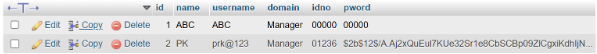
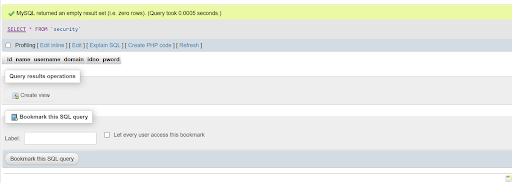
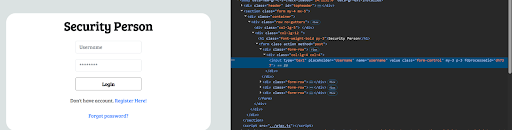
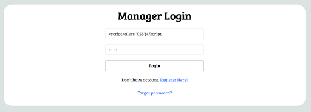
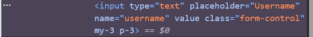
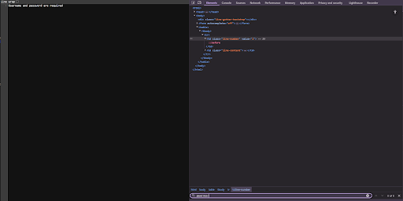

# 🔒 CYB5272 Final Project

## What is input validation?
Input validation is a part of Integrity in the CIA triad. It is used to ensure that the data entering a system meets the formatting requirements. Malicious actors can attack sites by SQL injection and XSS.

---

## Ways to analyze input validation

### 1. Analyze the client side by inspecting the HTML
- Look at the HTML code using dev tools to see how the input type of the username and password is set.
- The input type should be specified through a required pattern that eliminates the use of invalid characters or requests. 

### 2. Test input through black box testing
- Test black box input by entering certain edge cases which may go outside of the boundaries. 
- This can include:
    sql injection test, XSS test or directory traversal

### 3. Test the code for validation input
- Backend scripts written in javascript may include checks for email input methods. Invalid input is flagged. 
### 4. Analyze the database query
- Assess if the query in Sql prompts for raw user input

---
## Database assessment from the website's sql database

### Example of creating a new manager
Name: Nicholas
Username: NMFIT
Identity #: 60125
Password: fishing is fun

### Here you can see both the manager and security login databases saving input. The query is not protected directly from invalid input. The data is still encrypted when accepted though

---
## How to attack the vulnerability using an XXS attack
- Assessing the security risks involved with XSS attacks by malicious code injection
  

- Testing script input

  

- Analyzing the result

  

- Result:
         The flask framework has built in reflection parameters to block potential XSS attacks. When inserting the script into the input window, the site does not reflect this in
         devtools menu.

---
## Example of a vulnerable site being attacked using XSS

---

# How to mitigate risk

